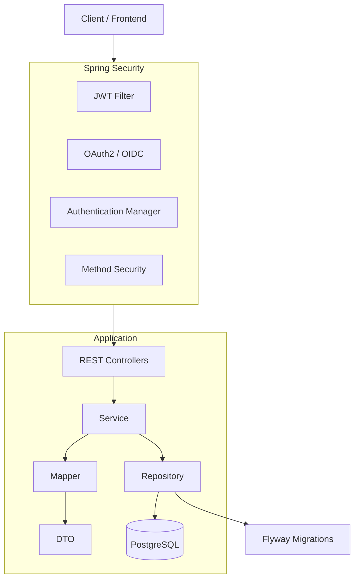
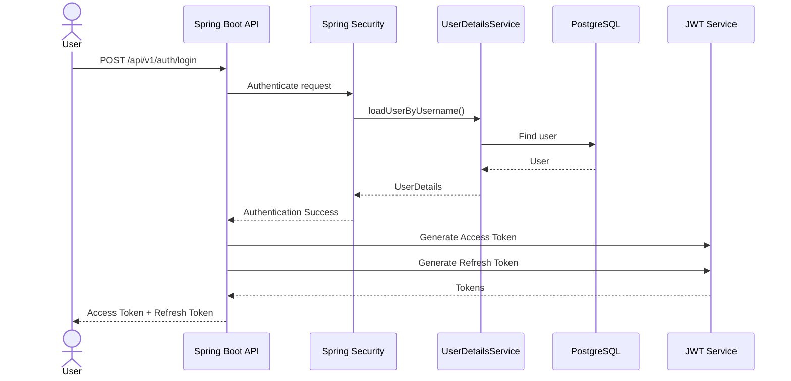
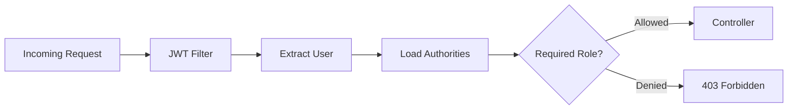
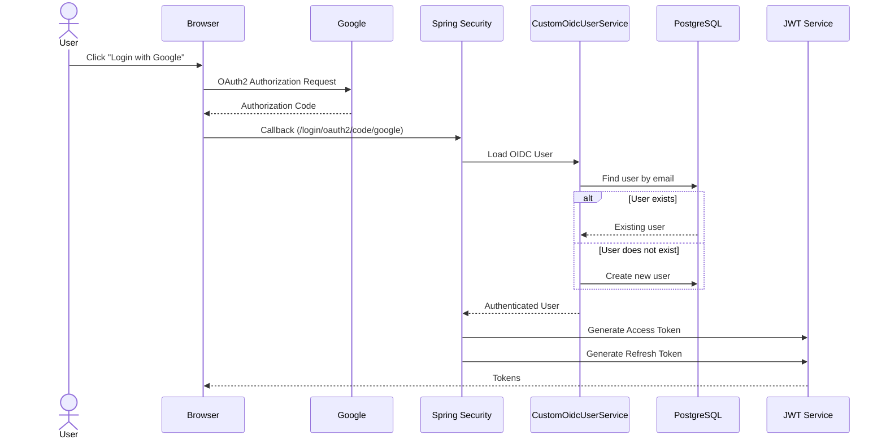

# Secure Employee API

A production-oriented Employee Management REST API built with **Spring Boot 4**, implementing modern authentication and authorization practices including **JWT**, **Refresh Token Rotation**, **Google OAuth2/OIDC Login**, **Role-Based Access Control (RBAC)**, and **Dockerized Deployment**.

The project is designed as a learning-focused yet production-ready backend that follows clean architecture principles, secure coding practices, and enterprise-grade Spring Security implementation.


## Overview

Secure Employee API is a backend application that demonstrates how modern enterprise applications implement authentication, authorization, user management, and secure REST APIs.

The project combines multiple Spring ecosystem modules into a single production-style application while keeping the architecture modular and maintainable.

It supports:

- Local authentication using JWT
- Refresh Token Rotation
- Google OAuth2 / OpenID Connect login
- Role-Based Authorization
- Method-Level Security
- Dockerized deployment
- PostgreSQL persistence
- Flyway database migrations
- OpenAPI (Swagger) documentation

## 🛠️ Tech Stack

### Backend

- Java 21
- Spring Boot 4.0.7
- Spring Security
- Spring Data JPA
- Spring Validation
- Spring MVC
- OAuth2 Client
- OpenID Connect (OIDC)

---

### Database

- PostgreSQL 15
- Flyway Migration

---

### Authentication & Security

- JWT Access Tokens
- Refresh Tokens
- BCrypt Password Encoder
- OAuth2 Google Login
- OpenID Connect
- Role-Based Access Control (RBAC)
- Method Security
- Stateless Authentication

---

### Documentation

- SpringDoc OpenAPI
- Swagger UI

---

### Object Mapping

- MapStruct

---

### Build Tool

- Maven

---

### Containerization

- Docker
- Docker Compose

---

### Development Tools

- IntelliJ IDEA
- Git
- GitHub


# 🏗️ Architecture Overview

Secure Employee API follows a layered architecture that separates concerns and promotes maintainability, scalability, and testability.

The application is organized into independent modules (User, Employee, Department, Position, Role, Refresh Token, Security, etc.), where each module contains its own controller, service, repository, DTOs, mappers, and entities.

Authentication and authorization are centralized inside the Security module using Spring Security.





### Layers

| Layer | Responsibility |
|--------|----------------|
| Controllers | Handle HTTP requests and responses |
| Services | Business logic |
| Repositories | Database access |
| Entities | JPA domain models |
| DTOs | Request and response objects |
| Mappers | Entity ↔ DTO conversion using MapStruct |
| Security | Authentication and authorization |
| Database | PostgreSQL with Flyway migrations |


# 📂 Project Structure

```text
src
└── main
    ├── java
    │   └── com.khaled.secure_employee_api
    │
    ├── common
    │   ├── config
    │   ├── exception
    │   ├── mapper
    │   └── util
    │
    ├── department
    │
    ├── employee
    │
    ├── position
    │
    ├── refresh_token
    │
    ├── role
    │
    ├── security
    │   ├── auth
    │   ├── jwt
    │   ├── oauth2
    │   ├── user
    │   └── config
    │
    ├── user
    │
    └── SecureEmployeeApiApplication.java
    │
    └── resources
        ├── db
        │   └── migration
        ├── application.yml
        ├── application-dev.yml
        ├── application-docker.yml
        └── static
```


### Package Responsibilities

| Package | Description |
|---------|-------------|
| common | Shared configuration, utilities, exceptions, and mappers |
| department | Department module |
| employee | Employee management module |
| position | Employee position management |
| refresh_token | Refresh Token management and rotation |
| role | Role and permission management |
| security | JWT, OAuth2, Spring Security configuration, authentication |
| user | User management and account information |
| resources/db/migration | Flyway SQL migration scripts |


### Design Philosophy

The project follows a **feature-based package organization** instead of placing all controllers, services, repositories, and entities into separate global folders.

Each business domain owns its own components, making the project easier to maintain, extend, and scale as new features are added.

This organization also aligns with modern Spring Boot development practices used in medium and large enterprise applications.


# 📋 Prerequisites

Before running the project, make sure you have the following installed:

| Software | Version |
|----------|---------|
| Java | 21+ |
| Maven | 3.9+ |
| Docker | Latest |
| Docker Compose | Latest |
| Git | Latest |

For local development (without Docker), you'll also need:

- PostgreSQL 15+
- A Google OAuth2 Client (Client ID & Secret)


# ⚙️ Environment Variables

Copy the example environment file.

```bash
cp .env.example .env
```

Then update the values according to your environment.

### Required Variables

| Variable | Description |
|----------|-------------|
| POSTGRES_DB | PostgreSQL database name |
| POSTGRES_USER | PostgreSQL username |
| POSTGRES_PASSWORD | PostgreSQL password |
| DB_URL | Database JDBC URL |
| JWT_SECRET | Secret key used to sign JWT tokens |
| JWT_ACCESS_TOKEN_EXPIRATION | Access token expiration time |
| JWT_ISSUER | JWT issuer |
| REFRESH_TOKEN_EXPIRATION | Refresh token lifetime |
| ADMIN_USERNAME | Default administrator username |
| ADMIN_EMAIL | Default administrator email |
| ADMIN_PASSWORD | Default administrator password |
| GOOGLE_CLIENT_ID | Google OAuth Client ID |
| GOOGLE_CLIENT_SECRET | Google OAuth Client Secret |

> **Important:** Never commit your `.env` file to version control.
>


# 🐳 Running with Docker

## 1. Clone the repository

```bash
git clone https://github.com/KhaledAlawi100/secure-employee-api.git
cd secure-employee-api
```

---

## 2. Create your environment file

```bash
cp .env.example .env
```

Fill in all required values.

---

## 3. Build the application

```bash
docker compose build
```

---

## 4. Start the containers

```bash
docker compose up -d
```

---

## 5. Verify the containers

```bash
docker ps
```

You should see:

- secure-employee-api
- secure-employee-postgres

---

## 6. View application logs

```bash
docker compose logs -f app
```

---

## 7. Stop the application

```bash
docker compose down
```

> Database data is stored in a Docker volume and will persist between restarts.

# 💻 Running without Docker

## 1. Clone the repository

```bash
git clone https://github.com/your-username/secure-employee-api.git
cd secure-employee-api
```

---

## 2. Create your environment file

```bash
cp .env.example .env
```

Update all required variables.

---

## 3. Start PostgreSQL

Ensure PostgreSQL is running locally.

---

## 4. Build the project

```bash
mvn clean install
```

---

## 5. Run the application

```bash
mvn spring-boot:run
```

Or run the `SecureEmployeeApiApplication` class directly from your IDE.

---

## 6. Verify the application

Open your browser:

```
http://localhost:8080
```

Swagger UI:

```
http://localhost:8080/swagger-ui/index.html
```

Health endpoint:

```
http://localhost:8080/actuator/health
```

# 📚 API Documentation

The project includes interactive API documentation powered by **SpringDoc OpenAPI**.

After starting the application, open:

```
http://localhost:8080/swagger-ui/index.html
```

The generated OpenAPI specification is available at:

```
http://localhost:8080/v3/api-docs
```

Swagger UI allows you to:

- Explore all available endpoints
- View request and response schemas
- Test endpoints directly from the browser
- Authorize using JWT Bearer Tokens
- Inspect validation constraints and HTTP responses

## Authorizing Requests

1. Authenticate using one of the authentication endpoints.
2. Copy the returned **Access Token**.
3. Click the **Authorize** button in Swagger.
4. Enter the token using the following format:

```
Bearer <your-access-token>
```

All secured endpoints can now be tested directly from Swagger UI.


## Authentication Flow



### Authentication Process

1. The client submits credentials to the login endpoint.
2. Spring Security authenticates the user using `AuthenticationManager`.
3. `UserDetailsService` loads the user from PostgreSQL.
4. After successful authentication:
    - A JWT Access Token is generated.
    - A Refresh Token is generated and stored in the database.
5. The tokens are returned to the client.


# Authorization

The application uses **Role-Based Access Control (RBAC)** to protect resources.

Each authenticated user is assigned one or more roles. Spring Security checks these roles before allowing access to protected endpoints.

## Authorization Flow



---

## Supported Roles

| Role | Description |
|------|-------------|
| ADMIN | Full access to the system |
| USER | Standard employee access |

---

## Endpoint Authorization

| Endpoint | Access |
|----------|--------|
| `/api/v1/auth/**` | Public |
| `/swagger-ui/**` | Public |
| `/v3/api-docs/**` | Public |
| `/api/v1/employees/**` | Authenticated |
| `/api/v1/admin/**` | ADMIN |
| `/api/v1/profile/**` | Authenticated |

---

## Method Security

The project also supports method-level authorization using Spring Security annotations such as:

- `@PreAuthorize`

This provides fine-grained access control in the service layer in addition to URL-based security.


# OAuth2 / OpenID Connect Login

The application supports authentication using **Google OAuth2 / OpenID Connect (OIDC)**.

Users can sign in with their Google account without creating a local password.

If the Google account does not already exist in the database, a new user account is created automatically.

---

## OAuth2 Login Flow



---

## OAuth2 User Provisioning

When a user signs in with Google for the first time:

- A new local account is created automatically.
- The provider is stored as `GOOGLE`.
- The Google subject identifier (`providerId`) is stored.
- A unique username is generated.
- The default `USER` role is assigned.
- A random encrypted password is generated (not used for Google login).

---

## Supported Provider

| Provider | Protocol |
|----------|----------|
| Google | OAuth2 + OpenID Connect |

---

## Login Endpoint

```
GET /oauth2/authorization/google
```

Spring Security automatically handles the OAuth2 authorization flow and redirects the user to Google's authentication page.


# Security Features

The project follows modern Spring Security best practices and is designed as a stateless REST API.

## Authentication

- JWT Access Token authentication
- Refresh Token support
- Google OAuth2 / OpenID Connect login
- BCrypt password hashing
- Stateless authentication

---

## Authorization

- Role-Based Access Control (RBAC)
- URL-level authorization
- Method-level security
- Fine-grained permission model

---

## Token Security

- Short-lived JWT Access Tokens
- Long-lived Refresh Tokens
- Refresh Token rotation
- Refresh Token revocation
- Device tracking
- Refresh Token expiration
- Refresh Token cleanup scheduler

---

## OAuth2 Security

- Google OAuth2 Login
- OpenID Connect (OIDC)
- Automatic user provisioning
- Provider ID persistence
- Secure account linking by email

---

## API Security

- CORS configuration
- CSRF disabled for stateless APIs
- Stateless Session Management
- Security Filter Chain
- JWT Authentication Filter
- Exception Handling
- AuthenticationEntryPoint
- AccessDeniedHandler

---

## Password Security

Passwords are never stored in plain text.

The application uses:

- BCrypt hashing
- Random password generation for OAuth2 accounts

---

## Database Security

- Flyway database migrations
- Entity validation
- Transaction management
- Repository abstraction using Spring Data JPA

---

## Production Readiness

- Environment-based configuration
- Docker support
- Docker Compose support
- Externalized secrets using environment variables
- Spring Profiles


# Database

The application uses **PostgreSQL** as its primary database.

Database schema changes are managed through **Flyway** migrations.

---

## Entity Relationship Diagram

> Replace the image path with your actual image location.


---

## Main Tables

| Table | Purpose |
|--------|----------|
| users | Application users and authentication data |
| roles | System roles (ADMIN, USER, etc.) |
| permissions | Fine-grained permissions |
| user_roles | Many-to-many relationship between users and roles |
| role_permissions | Many-to-many relationship between roles and permissions |
| employees | Employee domain information |
| departments | Company departments |
| positions | Employee job positions |
| refresh_tokens | Stores refresh tokens and device information |
| flyway_schema_history | Flyway migration history |

---

## Core Relationships

```text
User
 ├── 1 ───── 1 Employee
 ├── M ───── M Roles
 │               │
 │               └──── M Permissions
 │
 └── 1 ───── M Refresh Tokens

Employee
 ├── M ───── 1 Department
 ├── M ───── 1 Position
 └── M ───── 1 Manager (Self Reference)
```

---

## Database Features

- PostgreSQL
- Flyway Versioned Migrations
- Spring Data JPA
- Hibernate ORM
- Lazy Loading
- Transaction Management
- Many-to-Many Relationships
- One-to-One Relationships
- Self-Referencing Relationships


# Future Improvements

The following features are planned for future releases.

## Authentication & Security

- Email verification
- Password reset via email
- Two-Factor Authentication (2FA)
- Account lockout after multiple failed login attempts
- Remember Me functionality
- Multi-provider OAuth2 support (GitHub, Microsoft, Facebook)

---

## Employee Management

- Employee profile photos
- Employee search and filtering
- Employee import/export (Excel & CSV)
- Organization hierarchy visualization
- Audit history for employee changes

---

## Administration

- Admin Dashboard
- User Management
- Role & Permission Management UI
- Activity Logs
- Login History

---

## API

- API Rate Limiting
- API Versioning
- Pagination Improvements
- Global Search
- GraphQL API

---

## Notifications

- Email Notifications
- SMS Notifications
- In-App Notifications

---

## Performance

- Redis Caching
- Asynchronous Processing
- Message Queue (RabbitMQ / Kafka)

---

## DevOps

- CI/CD Pipeline
- Kubernetes Deployment
- Monitoring with Prometheus & Grafana
- Centralized Logging
- Distributed Tracing

---

## Testing

- Unit Tests
- Integration Tests
- Security Tests
- Testcontainers
- Performance Testing


